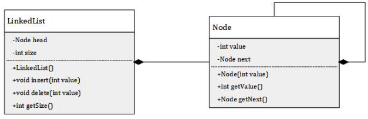

# Question 1

Suppose you are developing a similar (if not identical) project for a company. One teammate poses the following:

> "We do not have to worry about logging. The application is very small and tests should take care of any potential bugs. If we really need it, we can print some important data and just comment it out later."

Do you agree or disagree with the proposition? Please elaborate on your reason to agree or disagree. (~50-100 words)

___

**Answer**:

We disagree with the idea. Logging holds significant importance in every application, regardless of its scale. While testing is effective, it may not cover all real-world scenarios. Logging is indispensable for various purposes like monitoring, enhancing security, and facilitating debugging. Therefore, it should be implemented not only for its error-handling capabilities but also for the many advantages it offers, as mentioned earlier.
___

# Question 2

Suppose you have the following `LinkedList` implementation:



How could you modify the `LinkedList` class so that the value could be any different data type? Preferably, provide the code of the modified class in the answer.
___

**Answer**:
```java
public class UniqueLinkedList<T> {
    private Node<T> head;
    private int size;

    public UniqueLinkedList() {
        head = null;
        size = 0;
    }

    public void insert(T value) {
        if (!contains(value)) {
            Node<T> newNode = new Node<>(value);
            newNode.setNext(head);
            head = newNode;
            size++;
        }
    }

    public void delete(T value) {
        while (head != null && head.getValue().equals(value)) {
            head = head.getNext();
            size--;
        }

        Node<T> current = head;
        while (current != null && current.getNext() != null) {
            if (current.getNext().getValue().equals(value)) {
                current.setNext(current.getNext().getNext());
                size--;
            } else {
                current = current.getNext();
            }
        }
    }

    public int getSize() {
        return size;
    }

    public boolean contains(T value) {
        Node<T> current = head;
        while (current != null) {
            if (current.getValue().equals(value)) {
                return true;
            }
            current = current.getNext();
        }
        return false;
    }
}
```

___

# Question 3

How is Continuous Integration applied to (or enforced on) your assignment? (~30-100 words)

___

**Answer**:

Continuous Integration is applied to our assignment through a Git. We enforce continuous integration by requiring that all code changes are tested locally before being pushed to the Git repository. This ensures that new code does not break existing functionality. Additionally, Git allows us to collaborate effectively with our team, share work, and merge changes seamlessly, enabling us to work faster and maintain code quality through testing.
___

# Question 4

One of your colleagues wrote the following class:

```java
import java.util.*;

public class MyMenu {

    private Map<Integer, PlayerAction> actions;

    public MyMenu() {
        actions = new HashMap<>();
        actions.put(0, DoNothingAction());
        actions.put(1, LookAroundAction());
        actions.put(2, FightAction());
    }

    public void printMenuOptions(boolean isInCombat) {
        List<String> menuOptions = new ArrayList<>();
        menuOptions.add("What do you want to?");
        menuOptions.add("\t0) Do nothing");
        menuOptions.add("\t1) Look around");
        if(isInCombat) {
            menuOptions.add("\t2) Fight!");
        }
        menuOptions.forEach(System.out::println);
    }

    public void doOption() {
        int option = getNumber();
        if(actions.containsKey(option)) {
            actions.get(option).execute();
        }
    }

    public int getNumber() {
        Scanner scanner = new Scanner(System.in);
        return scanner.nextInt();
    }
}
```
List at least 2 things that you would improve, how it relates to test-driven development and why you would improve these things. Provide the improved code below.

___

**Answer**:

- Scanner Injection: We should inject scanner through the constructor, such that it will be easier to replace with a mock scanner when we are testing.
- Split the concerns: The first improvement is to split the concerns and functionality by moving the menu options and actions into separate methods. This will make it easier to facilitate testing later on.


Improved code:

```java
import java.util.*;

public class MyMenu {
    private Map<Integer, PlayerAction> actions;
    private Scanner scanner;

    public MyMenu(Scanner scanner, Map<Integer, PlayerAction> actions) {
        this.actions = actions;
        this.scanner = scanner;
    }

    public void printMenuOptions(boolean isInCombat) {
        List<String> menuOptions = getMenuOptions(isInCombat);
        menuOptions.forEach(System.out::println);
    }

    public void doOption() {
        int option = getNumber();
        if (actions.containsKey(option)) {
            actions.get(option).execute();
        }
    }

    private List<String> getMenuOptions(boolean isInCombat) {
        List<String> menuOptions = new ArrayList<>();
        menuOptions.add("What do you want to?");
        menuOptions.add("\t0) Do nothing");
        menuOptions.add("\t1) Look around");
        if (isInCombat) {
            menuOptions.add("\t2) Fight!");
        }
        return menuOptions;
    }

    private int getNumber() {
        return scanner.nextInt();
    }
}

```
___